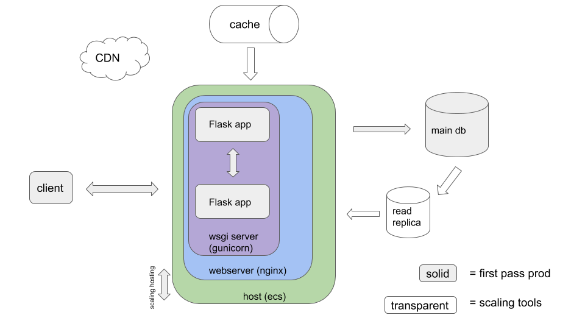

Wishlist Manager
# Summary
A Flask application running in docker with a PostgreSQL database, all managed by docker-compose.

## Approach
The basic requirement of the assignment is to create an API and storage solution to allow a user to manage a wishlist of books while storing some data about Users and Books.

My first step was to answer the following questions:

1. What are the pieces of data we care about and what do we want to know about?
- We care distinctly about Users and Books and some information about them.
- We care about how books relate to users in terms of a `wishlist`.
- We may or may not care to know more about a Wishlist.
- Assumption: a user can have one or many wishlists.

2. What are the questions we will ask of that data (how will we query it)?
- As a User, given a book I can add it to one or more wishlists.
- As a User, given a book, I can remove it from a wishlist.
- As a User, given a wishlist with books in it, I can retrieve that wishlist and see the books.

### Decisions:

1. Use a relational database.
- We're starting from a limited set of questions about our data and aren't sure how those questions may evolve as the product grows. Personal experience with alternative NoSQL datastores such as dynamo has taught me that it in order to truly benefit from that paradigm, the questions we're asking of the data need to be thoroughly understood.
- The data "feels" like it is relational.
  - A User can have one or many wishlists
  - A Book can belong to one or many wishlists
  - We want to know things about those things (e.g. first_name, last_name, etc)
- Chose PostreSQL: because it represents a fully-featured database that can serve applications at massive scale. When managed via `docker-compose` it becomes fairly simple to develop AND test against the data store
- Alternatives: MySQL, NoSQL

2. Use a scalable web-service as an API.
- This is a model that is very well understood across the software world - it has proven its ability to scale.
- Chose Flask: relatively lightweight, strong community, maturity, and scalable.
- Chose SQLAlchemy as an ORM
- Alternatives:

3. Use Docker and docker-compose to orchestrate all the pieces.
- Using containerized environments allows developers to closely emulate production environments locally.
- docker-compose allows relatively easy orchestration of a variety of resources "off the shelf"
- container images are deployable in a large variety of cloud computing services

# How To Make This "Production Ready"

1. The Flask application itself will need:
- a production WSGI server such as gunicorn which will also allow running multiple instances of the app on a host
- a reverse proxy such as nginx as a web server
- configuration injected from secure remote source (e.g. AWS Secrets Manager)

2. The database will need to be persisted remotely outside of the application

3. As a hosting service, we could utilize something like AWS ECS to allow dynamic scaling of the API
- would require implementing application load balancers (ALBs) as well as networking, routing, and certificate signing (HTTPS)

## Potential Future Scaling Solutions:

1. The database
- Indexing to increase efficiency of get wishlist query
- Read replica
- Sharding

2. Cacheing
- If wishlists are not likely to change much, cache the response to prevent unneeded database reads

# How to Run

To run tests:
    `make test`

To run the entire application locally with seed db data:
    `make run`

To connect to the database while running:
    `make shell-db`

## Example API calls:
(After running `make run`; all calls are based on seeded data in the db)

Create a wishlist entry:
    `curl -X POST localhost:5000/wishlist_entry -d '{"book_id": "dfe3157b-b402-4104-a0eb-e54bee1210f0", "user_id": "46bd51f9-e20b-4b4f-b5a7-f25339a34906"}' -H 'Content-Type:application/json'`

    Example Successful Response:
        Status code: 201
        `json
            {
                "book_id":"dfe3157b-b402-4104-a0eb-e54bee1210f0",
                "user_id":"46bd51f9-e20b-4b4f-b5a7-f25339a34906",
                "wishlist_id":"522f90d6-c4b9-4bcb-b4ca-72b9892d08b0"
            }
        `

Retrieve a wishlist:
    `curl localhost:5000/wishlist/<wishlist_id>`

    Example Successful Response:
        Status Code: 200
        `json
            {
                "books":[
                    {
                        "author":"Jack Canfield, Mark Victor Hansen, Amy Newmark",
                        "id":"dfe3157b-b402-4104-a0eb-e54bee1210f0",
                        "isbn":"978-1611599138",
                        "publication_date":"Tue, 25 Jun 2013 00:00:00 GMT",
                        "title":"Chicken Soup for the Soul 20th Anniversary Edition"
                    }
                ],
                "user_id":"46bd51f9-e20b-4b4f-b5a7-f25339a34906",
                "wishlist_id":"f8352d41-8902-4d8b-9a57-d9e9b5bc1417"
            }
        `

Delete a wishlist entry:
    `curl -X DELETE localhost:5000/wishlist_entry -d '{"wishlist_id":"<wishlist_id>", "book_id":"<book_id>"}' -H 'Content-Type:application/json'`

    Example Successful Response:
        Status Code: 200
        `"OK"`

# Resources:

1. Flask/Docker/Postgres Infrastructure
    https://testdriven.io/blog/dockerizing-flask-with-postgres-gunicorn-and-nginx/#docker

2. Flask Application structure and testing
    http://www.patricksoftwareblog.com/

